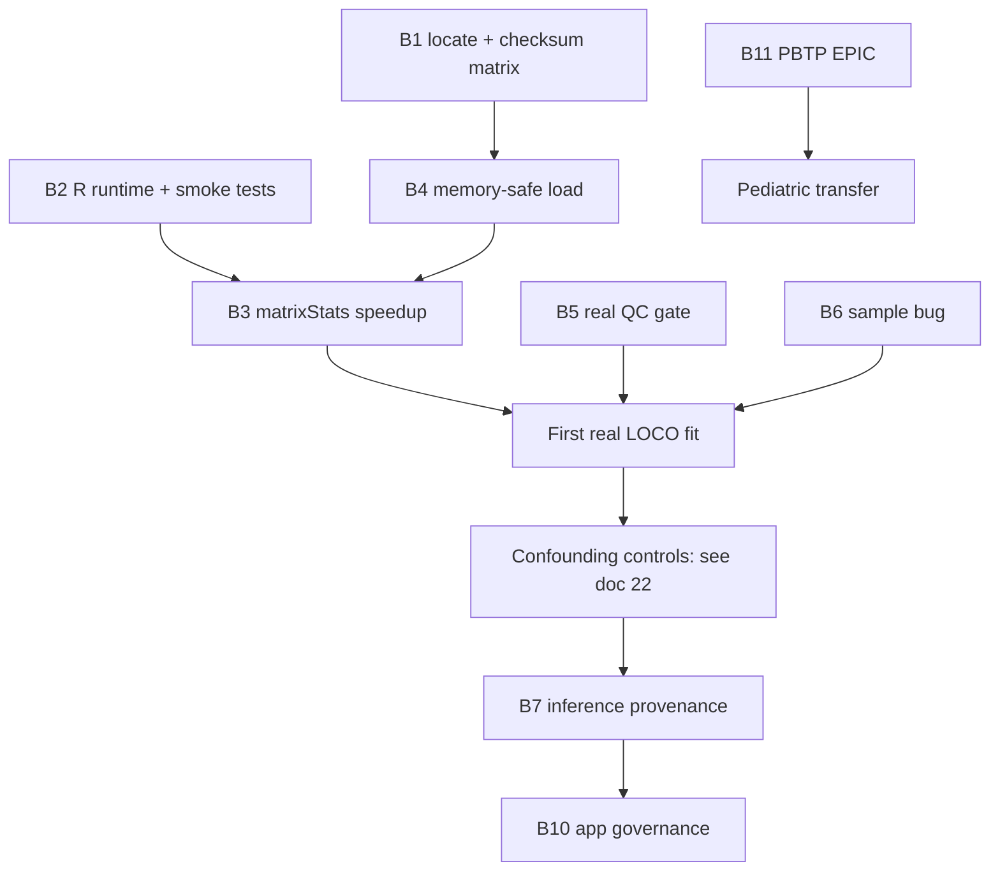

# 21. Blocker Resolution Plan

Status date: 2026-09-16. This document consolidates every known blocker into an
ordered, owner-assignable plan. Blockers are grouped by whether they gate the
*first real result* (P0), gate *credible claims* (P1), or gate *deployment and
handoff* (P2). Nothing here asserts a result that has been produced.

The single most important fact: **no biological model has been fit yet.** Every
performance statement in this repository is currently a plan, not a finding.

---

## P0 — Gates the first real result

### B1. Historical matrix payload is unlocated

**Symptom.** `docs/14_VERIFICATION_STATUS.md` records that only a 280,257-byte
header fixture is present locally, while the expected PanCanAtlas payload is
41,541,692,788 bytes. `config/published_beta_metadata.tsv` carries the expected
md5 (`a92f50490cf4eca98b0d19e10927de9d`).

**Why it blocks.** No feature matrix can be extracted, so no model can be fit.

**Resolution.**
1. Locate the payload on shared scratch; record its absolute path in
   `docs/03_DATA_ACQUISITION.md`.
2. Verify with `md5sum` against the manifest value. A mismatch means re-download,
   not "proceed with caution."
3. Record path + checksum + verification date in `CHANGELOG.md`.
4. Only then run `scripts/prepare_beta.py`.

**Done when.** A checksum-verified path is recorded and `prepare_beta.py` emits a
`.provenance.json` marked as real (not fixture).

---

### B2. R runtime never executed

**Symptom.** `docs/19_R_AND_SHINY_AUDIT.md` states no R executable was available;
all leakage and preprocessing guarantees are verified *by code inspection only*.

**Why it blocks.** Static inspection cannot catch runtime errors, and the
leakage guarantees are the scientific foundation of the whole design.

**Resolution.**
1. Run `Rscript scripts/setup.R` on the cluster; commit `renv.lock` only after a
   successful restore.
2. Run `Rscript tests/smoke_model.R` and record pass/fail in
   `docs/14_VERIFICATION_STATUS.md`.
3. Extend the smoke test with an explicit **leakage assertion**: fit
   preprocessing on a train split, confirm that held-out medians, variance
   ranking, and centering constants are byte-identical to the frozen training
   values and are *not* recomputed on test rows.

**Done when.** Smoke tests pass on real infrastructure and the leakage assertion
is part of the test suite rather than a comment.

---

### B3. Preprocessing is ~42 hours for full nested LOCO

**Symptom.** `R/model.R` lines 46–62: `fit_preprocess()` uses `apply()` across
~336k columns, ~2.8 minutes per call; nested LOCO needs ~900 calls.

**Resolution.**
1. Replace column-wise `apply()` with `matrixStats::colMedians` / `colVars`
   (documented in-file as reducing the estimate to ~17 hours).
2. Restrict the missingness filter and variance ranking to a single pass.
3. Benchmark on one outer fold before launching the full grid.
4. Submit as an LSF array job, one outer fold per task, rather than a single
   long-running job.

**Caution.** Do not reduce cost by screening features once on the full cohort —
that reintroduces exactly the leakage the design prevents. Speed fixes must be
implementation-level only.

**Done when.** One outer fold completes in a measured, recorded wall time and the
full run is scheduled within the event window.

---

### B4. Memory ceiling on matrix load

**Symptom.** `scripts/train_baseline.R` lines 33–72: ~21 GB for `fread()`, 60+ GB
peak through the transpose chain.

**Resolution.** Request a large-memory queue; subset to the 384,640-probe
allowlist *during* read rather than after; avoid retaining intermediate copies;
consider `data.table::setDT` in-place transforms. Record peak RSS.

---

## P1 — Gates credible claims

### B5. QC gate is tautological

**Symptom.** `scripts/train_baseline.R` line 128 checks
`quality_annotation == "published_450K_no_exclusion"`, but `build_master.py`
hardcodes that exact value. The check can never fail.

**Resolution.** Replace with a real gate: assert the provenance sidecar exists,
that its recorded checksum matches the loaded matrix, and that per-sample QC
fields (detection p-value pass rate, sex concordance) are present and within
bounds. A gate that cannot fail is worse than no gate, because it produces false
assurance in the audit trail.

---

### B6. Latent `sample()` bug

**Symptom.** `scripts/train_baseline.R` lines 212–217: `sample(ii, k)` where
`ii` has length 1 silently samples from `1:ii` instead of returning `ii`.

**Why it matters.** Currently masked (smallest development group, OV, has n=10)
but will fire on any subset or rarer stratum, producing invalid fold assignment
without an error.

**Resolution.** Guard with `if (length(ii) == 1L) ii else sample(ii, k)`, or use
`resample <- function(x, ...) x[sample.int(length(x), ...)]`. Add a unit test
with a single-element group.

---

### B7. `predict_frozen.R` has no provenance gate

**Symptom.** Unlike the training script, inference accepts any beta matrix and
will happily score an engineering fixture, then pass it to the Shiny app via
`KIDS26_DEMO_RESULTS` where it renders as "Approved precomputed results."

**Resolution.** Read the `.provenance.json` sidecar; refuse to score matrices
marked as simulated/fixture unless an explicit `--allow-fixture` flag is passed,
and stamp the output file with the provenance class so downstream display cannot
misrepresent it.

---

### B8. Lambda grid is hardcoded

**Symptom.** `R/model.R` uses five fixed lambda values spanning four decades, not
anchored to a glmnet-derived `lambda.max`. A boundary optimum is accepted
silently.

**Resolution.** Derive the path from `glmnet`'s own `lambda.max` per inner fold;
warn loudly if the selected lambda sits at either endpoint of the grid.

---

### B9. `HRD_high_probability` is always NA

**Symptom.** The exploratory threshold (42) lives in
`config/analysis_protocol.json` but is read by no R code.

**Resolution.** Either (a) drop the column until a calibration set justifies it,
or (b) wire it explicitly and label it exploratory in every output. Option (a) is
preferred before any public presentation — an always-NA column invites a reader
to assume a clinical threshold exists.

---

## P2 — Gates deployment and handoff

### B10. Shiny app governance gap

`app/app.R` validates the schema of `KIDS26_DEMO_RESULTS` but enforces no path
allowlist, checksum, or approval token; raw sample identifiers render as-is; the
`results` object is global and shared across sessions.

**Resolution.** Add a path allowlist + checksum check, hash or alias displayed
identifiers, move `results` inside `server()` for per-session isolation, and make
the provenance label derive from the stamped provenance class rather than from
`nzchar(Sys.getenv(...))`.

### B11. PBTP EPIC generation unconfirmed

The exact EPIC generation is unverified, so the 450K/EPIC bridge cannot be
finalized for pediatric transfer. Confirm generation with the data custodian
before freezing; if EPIC v2, the shared-probe intersection must be rebuilt and
its SHA-256 re-recorded.

### B12. Raw IDAT preprocessing bridge unbuilt

Deferred to post-hackathon per `docs/09_POST_HACKATHON_PLAN.md`. Needed only if
raw IDATs enter the pipeline; currently level-3 betas are used.

---

## Suggested execution order

B1 and B2 are independent and should run in parallel by different owners. Nothing
downstream of `FIT` can begin until both complete.
