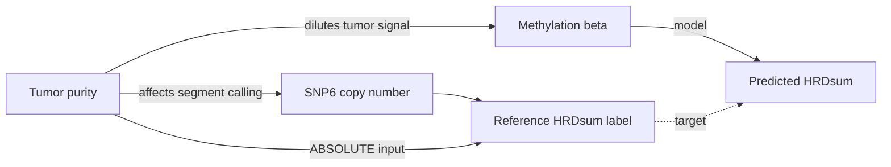

# 22. Confounding and Pan-Cancer Validity Plan

Status date: 2026-09-16. **Outcome recorded 2026-09-17 — see the box below.**

> ## OUTCOME: this plan's central prediction was correct
>
> LOCO run 01 (array `323078995`, n = 7,065, 30/30 folds) produced exactly the
> split this document anticipated. Full results: `docs/24_RESULTS_LOCO_RUN01.md`.
>
> | Estimand | Measured | Reading |
> |---|---|---|
> | **E1 (between-tissue)** | skill vs tissue-mean null = **+0.085** | Weak. Barely beats guessing each type's average. |
> | **E2 (within-tissue)** | Pearson **0.612**, permutation **p = 0.001** | Holds, in 29 of 30 tissues. |
>
> The recommendation below — *declare E2 the primary estimand and report E1
> separately* — is hereby **adopted as binding**. Had this document not
> pre-specified the split, the pooled +0.085 would most likely have been read as
> "the model barely works," when in fact it ranks patients within a tissue at
> r = 0.61 and merely mis-levels each tissue by 3.46 units on average.
>
> The warning that *"a pooled metric that silently averages the two is the single
> most likely way this project overstates its result"* proved half right, and in
> the more interesting direction: the pooled metric **understated** the usable
> signal, because the per-tissue offset error (E1 failure) swamped the E2 success.
>
> **Purity, however, went the wrong way.** §3's concern is now the project's most
> serious open defect (C3 in `docs/21`): `cor(pred, purity)` within tissue is
> 0.165 against `cor(label, purity)` of 0.019, and model skill is **negative**
> in the highest-purity third of samples. This is not yet explained.

This plan addresses four entangled threats to the
central claim: **tissue lineage**, **tumor purity**, **copy-number estimation**,
and whether the classifier is genuinely *pan*-cancer. These are not four
independent problems. They share a common structure, and treating them
separately is how a model of this kind ends up looking better than it is.

---

## 1. State the estimand first

The repository currently implies the question "can methylation predict HRDsum?"
That question is underspecified, and the ambiguity is where the confounding
hides. There are two distinct estimands:

**E1 (between-tissue).** Can the model rank cancer *types* by their typical
scar burden? Ovarian and basal breast carcinomas carry high HRDsum; many others
do not. A model can score well on E1 while containing no within-patient
information at all.

**E2 (within-tissue).** Given two tumors *of the same type*, can the model tell
which has higher scar burden? This is the clinically meaningful question, and
it is the one an N-of-1 pediatric application actually requires.

**Recommendation: declare E2 the primary estimand and report E1 separately.**
Report both, always, in the same table. A pooled metric that silently averages
the two is the single most likely way this project overstates its result.

### Variance decomposition (run before any modeling)

Fit `HRDsum ~ cancer_type` and report the ICC:

$$\text{ICC} = \frac{\sigma^2_{\text{between-type}}}{\sigma^2_{\text{between-type}} + \sigma^2_{\text{within-type}}}$$

If the ICC is high (plausible here), then a pooled $R^2$ is dominated by tissue
identity and should never be quoted as headline performance. This is a one-line
analysis that reframes every subsequent number, so it should run first.

---

## 2. Tissue confounding

**The mechanism.** Methylation is among the strongest tissue-of-origin
classifiers in genomics — that is precisely why methylation-based CNS tumour
classifiers work so well. A model given 384,640 CpGs and a tissue-correlated
outcome will learn lineage, because lineage is the easiest available signal.
LOCO does *not* prevent this: it prevents memorizing a held-out type's mean, but
the model can still predict "this looks like a squamous lineage, squamous
tumours score around X."

**Controls to implement** (`R/model.R` currently has none beyond a training-mean
null):

| Control | Construction | What it rules out |
|---|---|---|
| Training-mean null | Predict global training mean | Trivial baseline (already present) |
| **Tissue-mean null** | Predict held-out type's *observed* mean HRDsum | Whether the model beats simply knowing the tissue |
| **Within-tissue permutation** | Permute HRDsum *within* each cancer type, refit | Whether within-tissue signal exceeds chance |
| **Tissue-centered outcome** | Regress on $y_i - \bar{y}_{\text{type}(i)}$ | Isolates E2 directly |
| Lineage-predictor probe | Fit tissue classifier on the same features | Quantifies how much lineage signal is available |

The tissue-mean null is the decisive one. **If the model cannot beat the
held-out type's own mean, it has learned lineage, not HRD biology.** Note this
null is optimistic — it uses information unavailable at deployment — so beating
it is a demanding, honest bar.

Within-tissue permutation is the right null for E2: permuting globally would
destroy tissue structure too and produce a null that is trivially easy to beat.

---

## 3. Tumor purity

**The mechanism, and why it is worse than it looks.** Purity confounds this
design through *three* paths simultaneously:

Beta values are a mixture: an observed value is roughly
$\beta_{obs} \approx \pi \beta_{tumor} + (1-\pi)\beta_{normal}$. So purity is
*directly readable* from methylation. Meanwhile, purity enters the HRDsum label
through ABSOLUTE's segmentation — low-purity samples yield attenuated,
noisier scar calls. A model can therefore achieve real predictive accuracy by
inferring purity from methylation and exploiting purity's correlation with the
label. That is a genuine statistical association and a scientifically empty one.

`scripts/train_baseline.R` (lines 69–71) notes purity is deliberately excluded
from features. Excluding a confounder from the feature set does not remove it —
it only makes it unmeasured and unadjustable.

**Plan.**
1. **Retain purity and ploidy in the master table** as analysis covariates, never
   as model features. (Confirm they survive `build_master.py`.)
2. **Diagnose the two legs.** Fit `purity ~ methylation` with the same LOCO
   design — if methylation predicts purity well, leg one is confirmed. Then
   correlate `purity` with `HRDsum` within each type for leg two. Both legs must
   hold for the confound to operate.
3. **Partial correlation.** Report the correlation of predicted and observed
   HRDsum adjusting for purity, within type. If it collapses toward zero, the
   signal was substantially purity.
4. **Purity-stratified metrics.** Report performance in purity tertiles. A model
   performing well *only* in high-purity samples is a purity detector.
5. **Purity-matched sensitivity analysis.** Restrict to a narrow purity band
   (e.g. 0.5–0.8) and refit. Loss of power is expected; the direction of the
   estimate is what matters.
6. **Do not "regress out" purity as the primary analysis.** Purity is plausibly
   a collider-adjacent variable here (it influences both the feature and the
   label), so naive residualization can induce bias rather than remove it. Use
   stratification and matching as primary, residualization as sensitivity only.

---

## 4. Copy-number estimates and label quality

**The core measurement problem.** HRDsum = HRD-LOH + LST + TAI. All three
components are *allele-aware* — they require distinguishing maternal from
paternal copies. Methylation arrays yield **total** copy number only. As
`docs/10_GROUND_TRUTH_AND_CNV.md` records, copy-neutral LOH is invisible to
total-CN methods by construction: two copies are two copies whether or not they
descend from the same parent.

This is a hard identifiability limit, not a tuning problem. It should be stated
plainly in the abstract and the presentation.

**Consequences to handle.**
1. **The label has correlated error.** HRDsum is itself an estimate from SNP6 +
   ABSOLUTE, with error that varies with purity and ploidy. Errors-in-variables
   attenuates apparent performance and makes comparisons across types unfair
   (low-purity-skewed types get noisier labels). Where ABSOLUTE quality flags
   exist, report performance with and without low-confidence labels.
2. **Decompose the target.** Fit HRD-LOH, LST, and TAI separately. If
   performance concentrates in LST and TAI — the two components with the
   strongest total-CN footprint — and is weak for HRD-LOH, that is an
   interpretable, honest result consistent with the identifiability argument. It
   also makes the finding *more* credible, not less.
3. **Ploidy as covariate.** LST and TAI thresholds interact with ploidy;
   whole-genome-doubled tumours behave differently. Stratify by WGD status.
4. **Treat `cnv_features.py` output as a proxy.** Keep total-CN structural
   features as a *secondary* gated branch, clearly labelled as a surrogate, and
   only after the CpG-only baseline has been evaluated against the nulls above.

---

## 5. Is it actually "pan-cancer"?

**Current design.** LOCO across 30 types with GBM/LGG locked away. The structure
is right — held-out-type evaluation is the correct frame for a pan-cancer claim,
and macro-averaging across types (rather than pooling) is the correct
aggregation. Two additions are needed.

**A. Report the distribution, not the average.** A macro-MAE hides the shape of
the result. Report per-held-out-type MAE against that type's own mean null, as a
forest-style plot. The honest summary is usually "works for k of 30 types,"
and which k matters enormously: if performance concentrates in high-HRD types
(OV, BRCA) the model may be detecting a narrow biological phenomenon rather than
a general one.

**B. Test the generalization gradient.** Pan-cancer validity is about distance,
not count. Order held-out types by methylome distance from the training set and
regress per-type performance on that distance. A steep decline means the model
interpolates among similar lineages rather than generalizing — directly relevant
to the pediatric HGG target, which sits far from adult TCGA in methylation
space.

**C. Recognize what the pediatric step actually is.** Adult TCGA → pediatric HGG
is a compound shift: different lineage, different age, different array
generation, different preprocessing, possibly different HRD biology. The
conformal interval in `R/model.R` assumes exchangeability, which does **not**
hold here (already flagged at line 337). Coverage is therefore not guaranteed,
and the interval should be presented as heuristic. Prefer abstention: if the OOD
flag fires, report "out of domain" rather than a number with a reassuring band.

---

## 6. Minimum reporting standard

No performance claim leaves this project without all of:

1. Metric computed **within** cancer type (E2), not pooled.
2. Comparison against the **tissue-mean null**, not only the training-mean null.
3. **Purity-stratified** breakdown.
4. **Per-type** results shown as a distribution, not a single average.
5. Explicit statement that HRDsum components are allele-aware and total-CN
   methylation cannot recover copy-neutral LOH.

---

## 7. Sequencing

These controls are cheap relative to the main fit — most reuse predictions that
already exist. Run them in this order:

| Order | Analysis | Cost | Decision it informs |
|---|---|---|---|
| 0 | ICC of HRDsum by type | Minutes | Whether pooled metrics are meaningful at all |
| 1 | Tissue-mean null vs LOCO | Reuses fit | Whether there is any result to report |
| 2 | Within-tissue permutation | 1 refit | Whether E2 signal exceeds chance |
| 3 | Purity two-leg diagnosis | Reuses fit | Whether purity confounding is active |
| 4 | Purity-stratified metrics | Reuses fit | Scope of any claim |
| 5 | Component decomposition | 3 refits | Interpretability, identifiability |
| 6 | Distance-gradient analysis | Reuses fit | Pediatric transfer plausibility |

Step 0 and step 1 are the gate. **If the model does not beat the tissue-mean
null, steps 3–6 are not worth running**, and the correct deliverable becomes a
well-documented negative result — which, given how rarely tissue confounding is
controlled in this literature, is a legitimate and publishable contribution.
